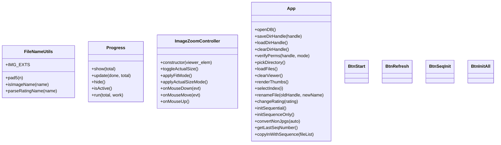
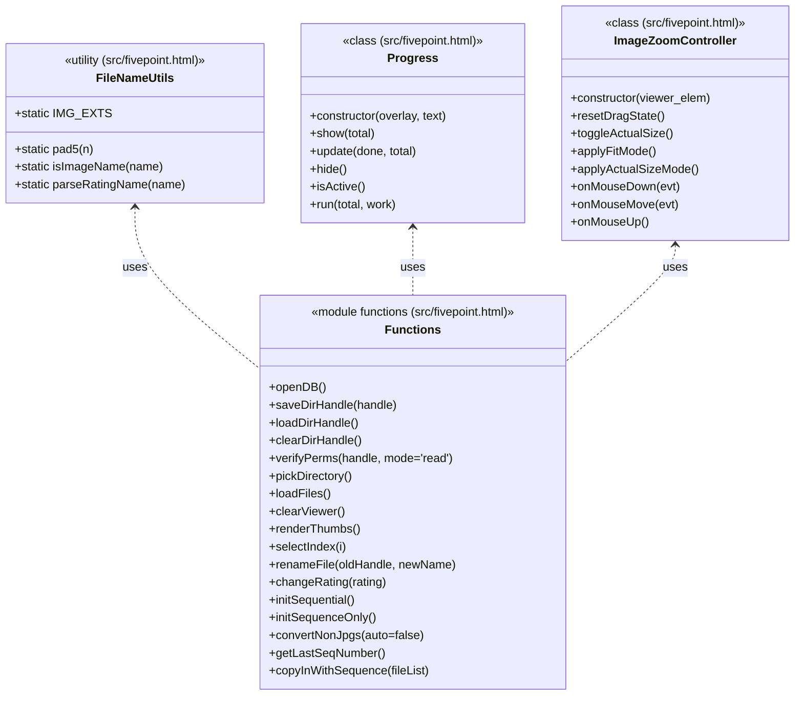
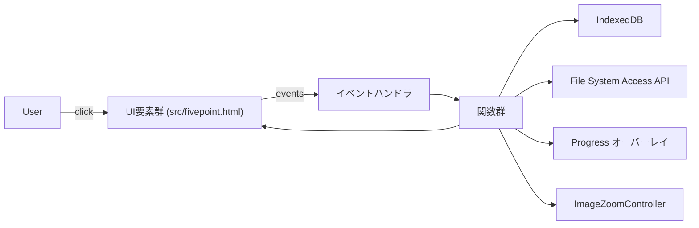

# アーキテクチャ

## ファイル配置
- FileNameUtils の各メソッド: `fivepoint.html`
- Progress の各メソッド: `fivepoint.html`
- App クラス相当の各関数: `fivepoint.html`
- BtnStart / BtnRefresh / BtnSeqInit / BtnInitAll クラス: `fivepoint.html`
- ImageZoomController の各メソッド: `fivepoint.html`
# アーキテクチャ概要（src/fivepoint.html）

以下は本プロジェクトの主要クラスと関数の俯瞰図です。クラス内のメソッドおよびモジュール関数を網羅し、定義ファイルを括弧書きで併記しています。

主要データフロー（高レベル）

補足

- すべてのメソッド・関数は `src/fivepoint.html` に定義されています。
- UI は同ファイル内の HTML/DOM 要素（ID/クラス）に対応します。
- ファイル入出力はブラウザの File System Access API を利用しています。
