# メソッド・関数コールチェーン

## 📁 フォルダ選択ボタンをクリック
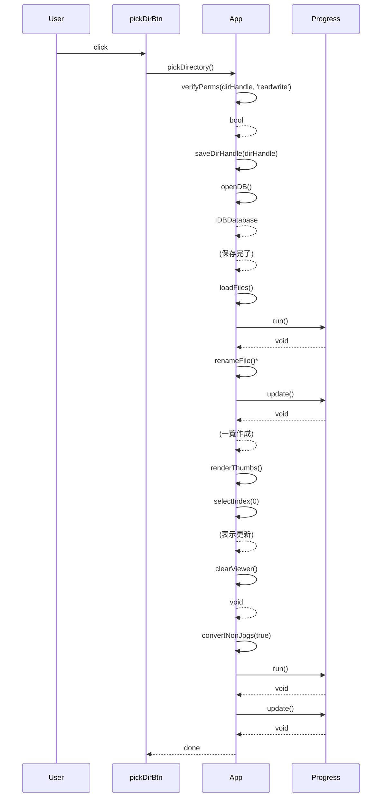

## 🔄 再読み込みボタンをクリック
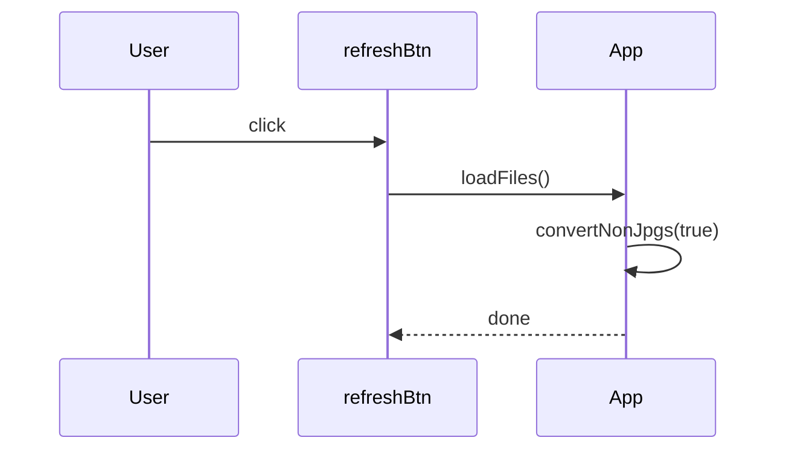

## 🔢 評価セレクト変更
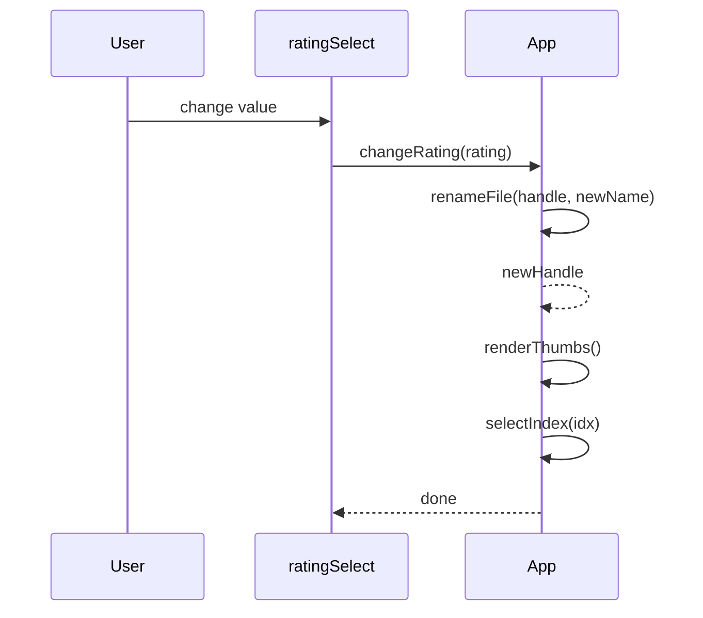

## 🧹 全て初期化ボタンをクリック
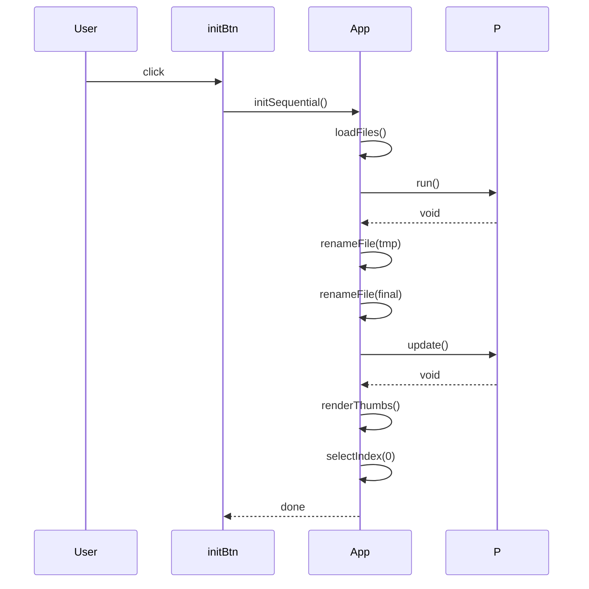

## 🧹 通番のみ初期化ボタンをクリック
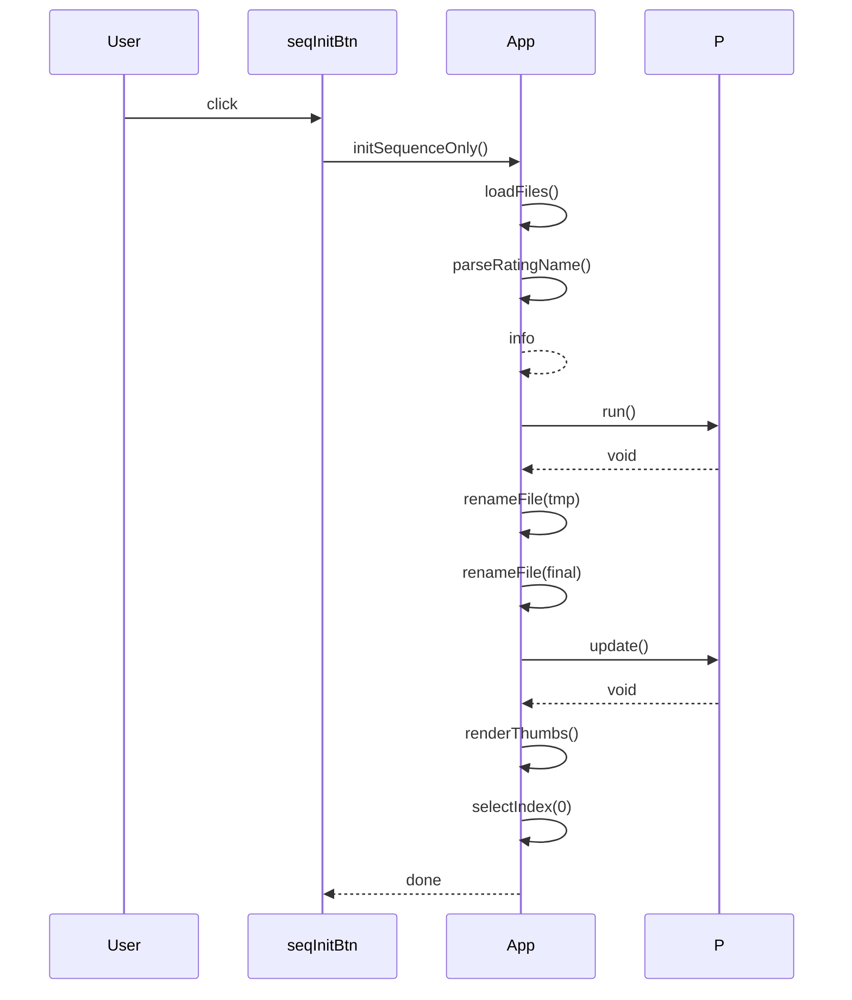

## 📂 ファイルをドロップ
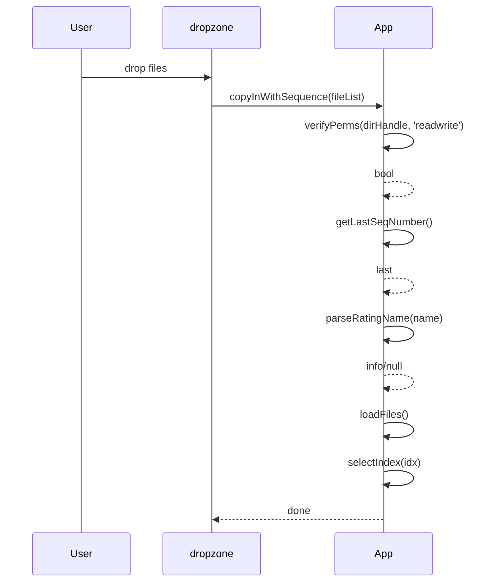

## セッション復元
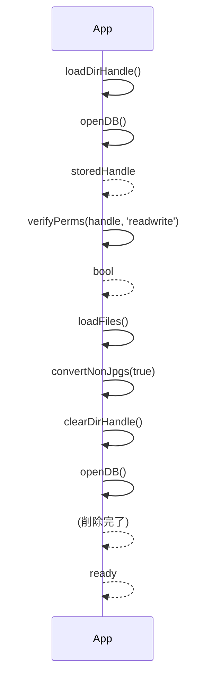

## 🖼 ビューア画像をクリックして実寸表示を切り替え
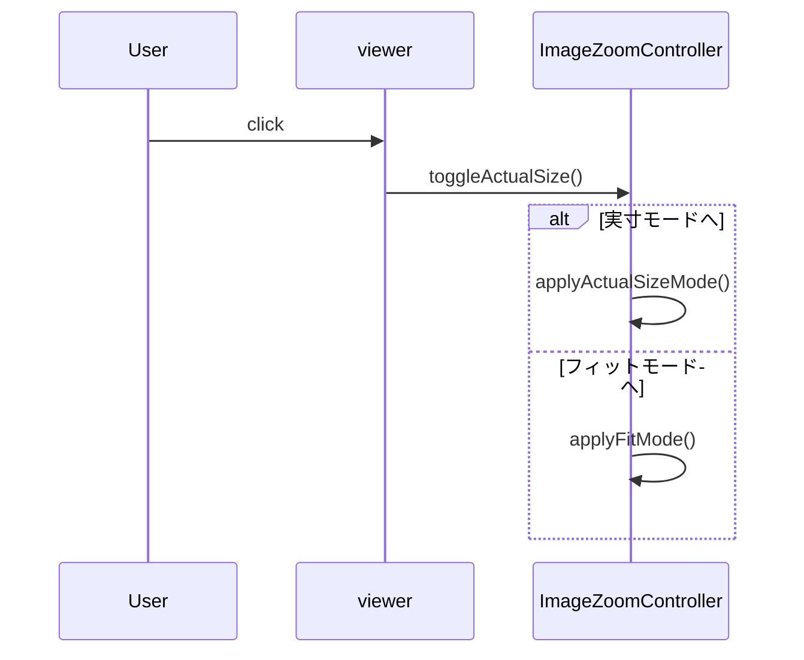

## ファイル配置
- すべてのメソッド・関数: `fivepoint.html`
# コールチェーン（シーケンス図）

すべて `src/fivepoint.html` の関数・メソッドです。同期/非同期を矢印注記で明示し、戻り矢印も描画します。

起動時（セッション復元）

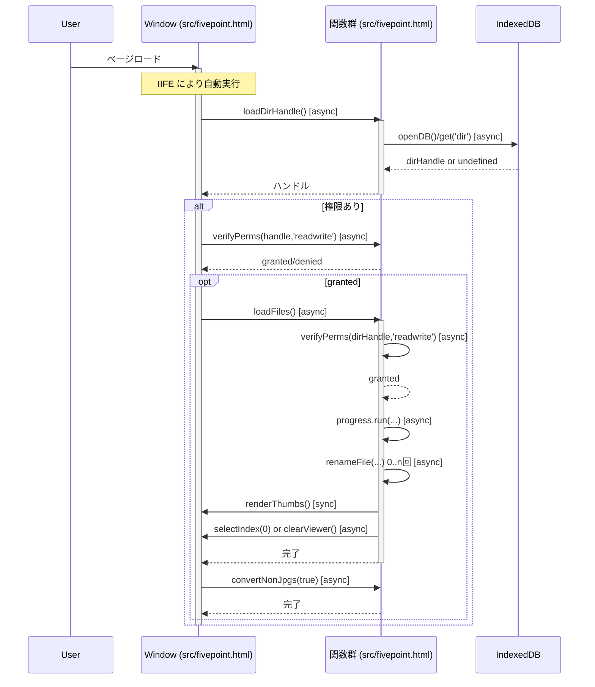

フォルダ選択フロー

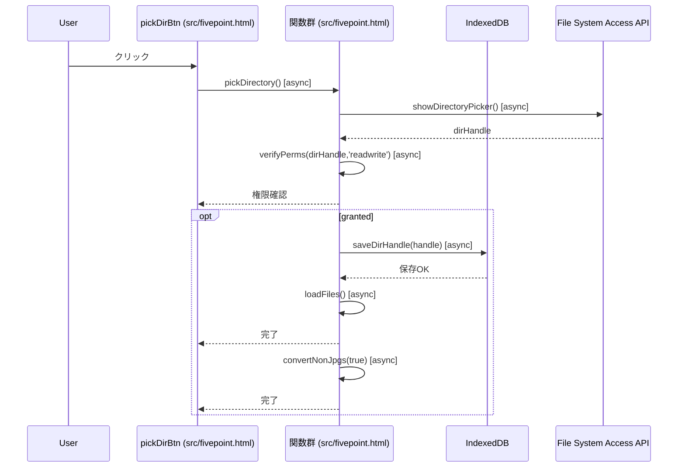

評価変更フロー（ドロップダウン/数字キー）

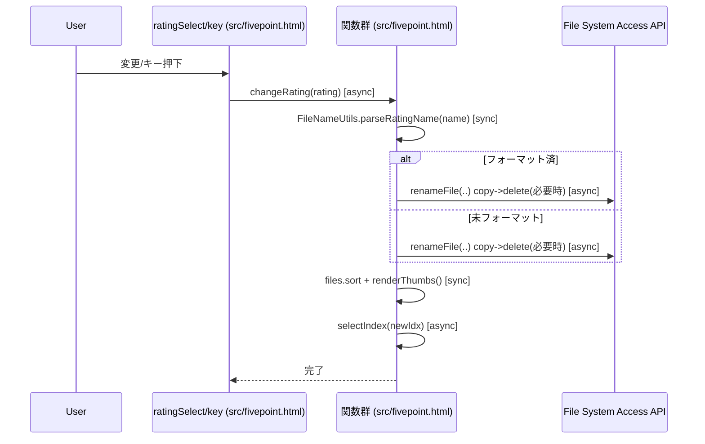

初期化フロー（全初期化・通番のみ）

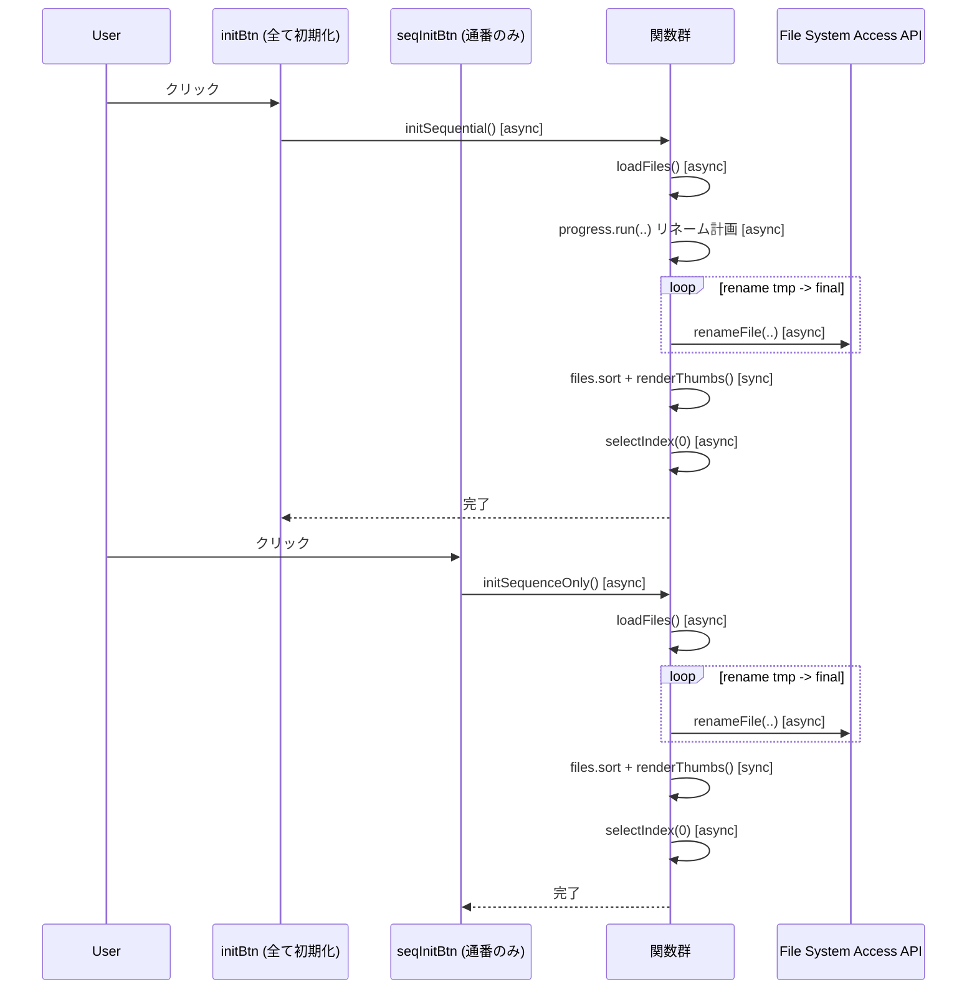

ドロップ追加フロー（Drag & Drop）

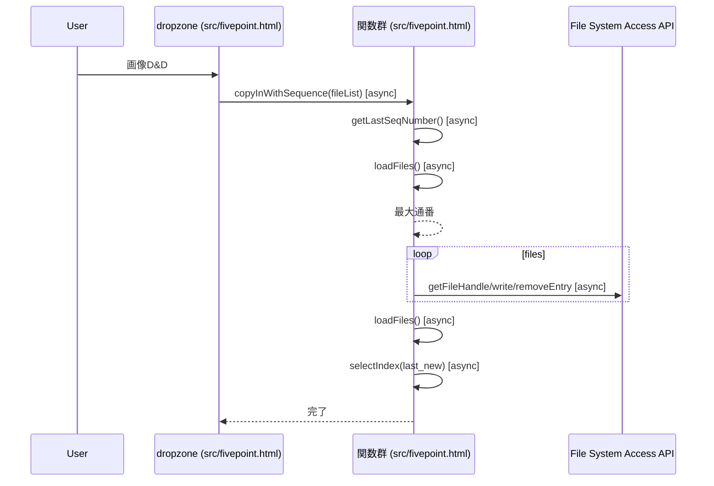

ビューア動作（実サイズ切替とドラッグ）

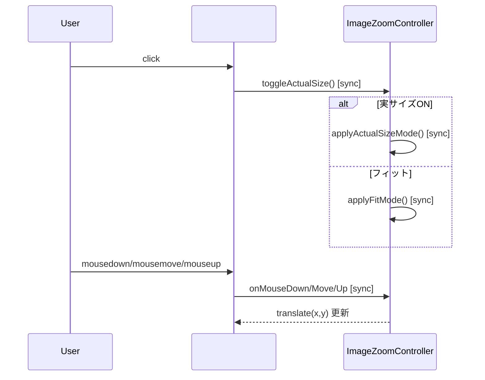
