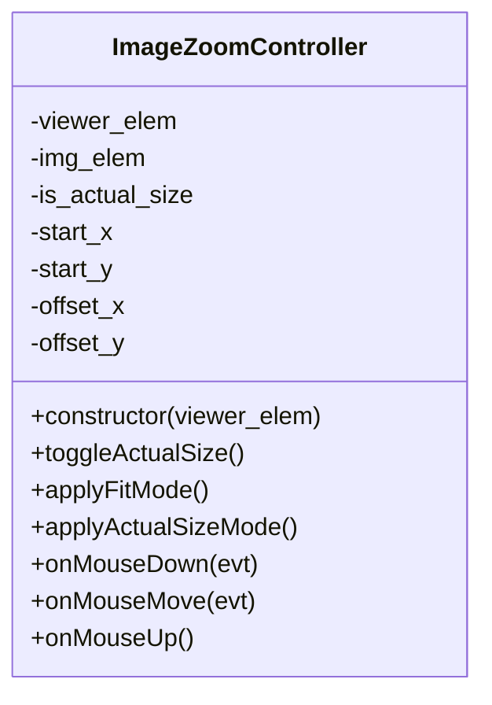
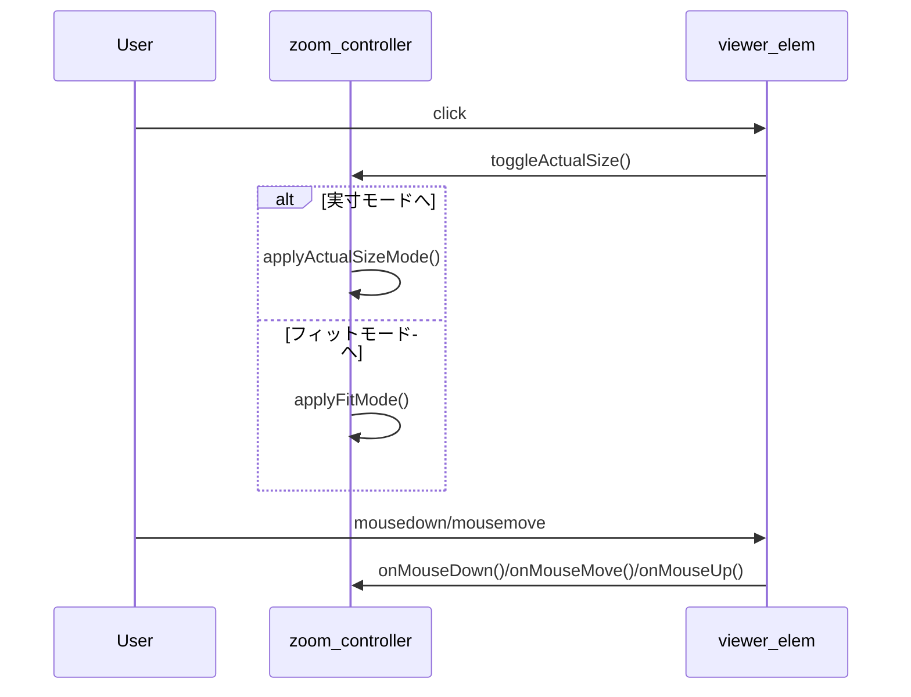

# 設計・実装仕様

## 1. 概要
左側のビューア内の画像をクリックすると実際の画像サイズで表示し、再度クリックで元の表示に戻す。

## 2. DOM/CSS設計
- ビューア要素: `.viewer`。
- 画像要素: `.viewer img`。
- 実寸モード時は `.viewer--actual` クラスを付与する。
- `.viewer--actual img` では `width: auto; height: auto; max-width: none; max-height: none;` を適用する。
- ドラッグ操作のため `.viewer--actual` に `cursor: move; overflow: hidden;` を設定する。

## 3. クラス設計

### クラス詳細
- 役割: ビューア内画像の実寸表示とドラッグ移動を制御する。
- プロパティ:
  - `viewer_elem`: `HTMLElement`。`.viewer` を参照。
  - `img_elem`: `HTMLImageElement`。`viewer_elem` 内の画像。
  - `is_actual_size`: `boolean`。実寸モードかどうか。
  - `start_x`, `start_y`: `number`。ドラッグ開始時座標 (px)。
  - `offset_x`, `offset_y`: `number`。現在の平行移動量 (px)。
- メソッド:
  - `constructor(viewer_elem)`
    - `viewer_elem` と `img_elem` を保持する。
    - `viewer_elem` の `click` に `toggleActualSize` をバインドする。
    - `viewer_elem` の `mousedown` に `onMouseDown` をバインドする。
    - `window` の `mousemove` に `onMouseMove`、`mouseup` に `onMouseUp` をバインドする。
  - `toggleActualSize()`
    - `is_actual_size` を反転する。
    - `is_actual_size` が `true` なら `applyActualSizeMode`、`false` なら `applyFitMode` を呼ぶ。
  - `applyFitMode()`
    - `viewer_elem` から `.viewer--actual` を除去する。
    - `img_elem` のスタイルを `width: 100%; height: 100%; object-fit: contain; transform: none;` に設定する。
    - `offset_x` と `offset_y` を `0` にリセットする。
  - `applyActualSizeMode()`
    - `viewer_elem` に `.viewer--actual` を付与する。
    - `img_elem` のスタイルを `width: auto; height: auto; max-width: none; max-height: none; transform: translate(0px, 0px);` に設定する。
    - `offset_x` と `offset_y` を `0` にリセットする。
    - `img_elem.naturalWidth` と `img_elem.naturalHeight` を取得し、`viewer_elem` より大きい場合のみドラッグを有効化する。
  - `onMouseDown(evt)`
    - `is_actual_size` が `true` かつ `evt.button === 0` の場合のみ処理する。
    - `start_x`, `start_y` に `evt.clientX`, `evt.clientY` を保存する。
  - `onMouseMove(evt)`
    - `start_x` が `undefined` の場合は何もしない。
    - 移動量 `dx = evt.clientX - start_x`, `dy = evt.clientY - start_y` を計算する。
    - 新しいオフセット `new_x = offset_x + dx`, `new_y = offset_y + dy` を計算し、
      `x` は `- (img_elem.width - viewer_elem.clientWidth)` から `0`、
      `y` は `- (img_elem.height - viewer_elem.clientHeight)` から `0` の範囲に収める。
    - `img_elem.style.transform = \`translate(${new_x}px, ${new_y}px)\`` を適用する。
    - `start_x`, `start_y`, `offset_x`, `offset_y` を更新する。
  - `onMouseUp()`
    - `start_x` と `start_y` を `undefined` にしてドラッグを終了する。

## 4. 連携処理
- `selectIndex(i)` で新しい画像を表示する際、`zoom_controller.applyFitMode()` を呼び出して実寸モードを解除する。
- 初期化時に `const zoom_controller = new ImageZoomController(document.querySelector('.viewer'))` を実行する。

## 5. シーケンス図

## 6. 参考情報
- `.viewer` の表示領域サイズは固定し、変更しない。
- 実際の画像がビューアより小さい場合、ドラッグ操作は無効とする。
- 命名は 02-project.txt の規約に従う。
