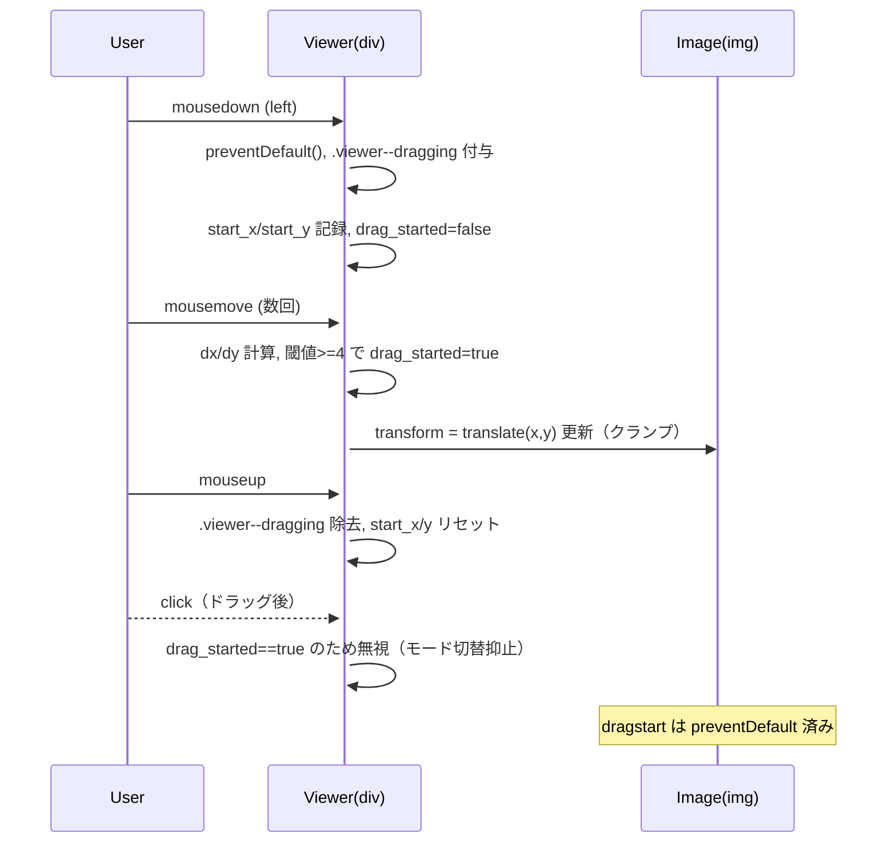

# 設計・実装仕様: 初回ドラッグで禁止カーソルが出る不具合の解消

## 目的
- 「実際の画像サイズで表示」モードにおいて、初回のドラッグ操作から画像をドラッグ可能にし、禁止アイコンが表示されないようにする。

## 原因仮説（技術的背景）
- IMG 要素のネイティブ DnD が初回に発火し、ドロップ先が無いためブラウザ既定の「禁止」カーソルが表示される可能性が高い。
- クリックで実サイズ切替を兼ねているため、軽微なドラッグでも click と判定され、状態遷移が初回のみずれている可能性もある。

## 対応方針（概要）
- 画像のネイティブ DnD を無効化する（`draggable=false` と `dragstart` の `preventDefault()`）。
- 実サイズモード時のカーソルを `grab`/ドラッグ中は `grabbing` に明示変更し、禁止カーソルの介入余地を無くす。
- クリックとドラッグの閾値を導入（例: 4px）。閾値超えでドラッグと判定した場合は click によるモード切替を抑止する。
- 既存のマウスイベント実装を温存しつつ、必要最小限の変更で初回から一貫動作させる。

## 仕様詳細
- ネイティブ DnD 無効化
  - 対象: ビューア内のメイン画像要素 `#mainImage`。
  - 実装: 初期化時に `img.draggable = false` を設定し、`img.addEventListener('dragstart', e => e.preventDefault());` を追加。
  - CSS 補助: `img { user-select: none; -webkit-user-drag: none; }` をスタイルに追加。

- カーソル制御
  - 実サイズモード（`.viewer--actual`）ではデフォルトカーソルを `cursor: grab;` にする。
  - ドラッグ中は `.viewer--dragging` を `viewer` に付与し `cursor: grabbing;` を適用。
  - マウスダウン時に即時 `viewer` に `.viewer--dragging` を付与、マウスアップで除去。

- クリックとドラッグの切り分け
  - 閾値: 4px（X または Y のいずれかが 4px 以上動いたらドラッグ扱い）。
  - `onMouseDown` で `drag_started=false` として開始し、`onMouseMove` で閾値を超えたら `drag_started=true` にする。
  - `viewer` の click ハンドラ内では `drag_started` が true の直後クリックを無視し、モード切替を抑止。

- ドラッグ移動の範囲
  - 現行ロジック（`transform: translate(x,y)` のクランプ）は踏襲。
  - クランプ算出は現行の `clientWidth/Height` と `img.width/height` を用いる（今回の不具合解消が主目的のため範囲仕様は据え置き）。

## 変更点（ファイル/コード単位）
- `src/fivepoint.html`
  - CSS 追記:
    - `.viewer--actual { cursor: grab; }`
    - `.viewer--dragging { cursor: grabbing; }`
    - `.viewer img { user-select: none; -webkit-user-drag: none; }`（既存に統合）
  - `ImageZoomController` クラス:
    - `constructor` に以下を追加
      - `this.img_elem.draggable = false;`
      - `this.img_elem.addEventListener('dragstart', e => e.preventDefault());`
      - 内部フラグ: `this.drag_started = false;`
    - `onMouseDown(evt)`
      - 先頭で `evt.preventDefault();` を追加（テキスト選択・ネイティブ DnD 抑止）。
      - `this.drag_started = false;`
      - `this.viewer_elem.classList.add('viewer--dragging');`
    - `onMouseMove(evt)`
      - dx/dy の絶対値が 4px 以上で `this.drag_started = true;`
    - `onMouseUp()`
      - `this.viewer_elem.classList.remove('viewer--dragging');`
    - `viewer_elem.addEventListener('click', ...)` のハンドラ修正
      - `if (this.drag_started) return;` を先頭に追加し、ドラッグ直後の click でモード切替されないようにする。

## イベントフロー（mermaid）

## 定量仕様
- ドラッグ判定閾値: 4px（X または Y のいずれか）。
- カーソル種別: 実サイズアイドル時 `grab`、ドラッグ中 `grabbing`。
- 反応遅延: 1フレーム以内（体感不可）を目標。

## 受け入れ条件との対応
- 初回ドラッグで即座に画像が追従: ネイティブ DnD 無効化と `preventDefault` により達成。
- 禁止アイコンが表示されない: `cursor` 明示と `dragstart` 抑止により達成。
- 2回目以降の一貫性: 既存ロジック温存＋フラグ制御で達成。
- 他機能の退行なし: クリック切替はドラッグ時のみ抑止し、通常クリックは維持。

## リスクと緩和
- 一部ブラウザで `-webkit-user-drag` が不要/未対応: `dragstart` の `preventDefault` と `draggable=false` が主対策で冗長対策として CSS を併用。
- クリックの意図がドラッグと誤判定される: 閾値(4px)を採用。必要なら 3〜6px の範囲で微調整可能。

## 実装手順（タスク）
1. CSS を追加（`grab/grabbing` と user-select/drag 無効）。
2. `ImageZoomController` 初期化で `draggable=false` と `dragstart` 抑止を追加。
3. マウスダウンで `preventDefault` と `.viewer--dragging` 付与、フラグ初期化。
4. マウスムーブで閾値超え判定しフラグ更新。
5. マウスアップで `.viewer--dragging` を除去。
6. クリックハンドラでドラッグ後クリックを無視。
7. 手動確認（要件の受け入れ条件に準拠）。
