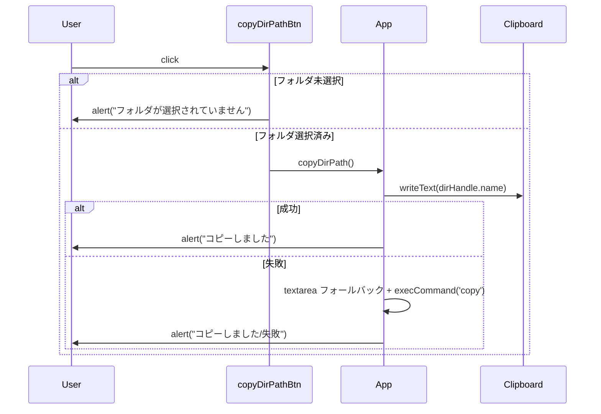

# 設計・実装方針

当初の「フォルダを開く」ボタンはブラウザからOSのエクスプローラーを直接開けないため取り下げ。代替として「選択中フォルダのパスをクリップボードにコピー」ボタンを追加する。

参考: context/guideline/01-common.txt, context/doc/01-architecture.md, context/doc/02-callchain.md, context/doc/03-processor.md, context/doc/04-ui.md

## 1. 概要
- 目的: 選択中フォルダへ素早くアクセスできるよう、パス取得操作をワンクリック化する。
- 前提: Web の File System Access API は OS の絶対パスを露出しない。現状はフォルダ名のみ取得可能。
- 方針: まずはフォルダ名をコピー対象とし、将来 OS 連携が可能になった場合に絶対パスへ置換できる設計にする。

## 2. UI/DOM/CSS 設計
- 追加場所: ヘッダー左ブロック（`#pickDirBtn` と `#refreshBtn` の並び）。
- 要素: `<button id="copyDirPathBtn" class="primary" title="選択中フォルダのパスをコピー" aria-label="フォルダパスをコピー">📋 パスコピー</button>`
- スタイル: 既存の汎用ボタンスタイルを流用（`button.primary`）。新規カラーバリアントは追加しない。
- 表示状態: 常時表示。未選択時に押下した場合はアラート表示で通知。

## 3. 実装設計（関数・イベント）
- 新規関数: `async function copyDirPath()`
  - `dirHandle` が未設定なら `alert('フォルダが選択されていません'); return;`
  - 文字列決定: `const text = dirHandle.name; // 現状のブラウザでは絶対パスは取得不可`
  - クリップボード: `await navigator.clipboard.writeText(text)` を試行。失敗時は `<textarea>` を用いたフォールバックでコピーを試みる。
  - ユーザー通知: 成功時/失敗時ともに `alert` で簡易通知（プログレスUIの導入は不要）。
- イベント登録: `document.getElementById('copyDirPathBtn').addEventListener('click', copyDirPath);`
- 依存・前提:
  - `navigator.clipboard` は HTTPS かつユーザー操作コンテキストでのみ利用可能。
  - File System Access API が利用できない環境では、そもそもフォルダ選択ができないため本機能も利用不可。

### 擬似コード
```
async function copyDirPath() {
  if (!dirHandle) { alert('フォルダが選択されていません'); return; }
  const text = dirHandle.name; // 現状: 絶対パスは取得不可
  try {
    await navigator.clipboard.writeText(text);
    alert('コピーしました');
  } catch (_) {
    // フォールバック: 非推奨だが一時テキストエリアで対応
    const ta = document.createElement('textarea');
    Object.assign(ta.style, { position: 'fixed', opacity: '0' });
    ta.value = text; document.body.appendChild(ta); ta.select();
    try {
      const ok = document.execCommand('copy');
      alert(ok ? 'コピーしました' : 'コピーに失敗しました');
    } finally { ta.remove(); }
  }
}
```

## 4. シーケンス


## 5. 非機能・制約・互換性
- ブラウザ: Chrome/Edge 系での動作を想定。`showDirectoryPicker` と `navigator.clipboard` が必要。
- セキュリティ: クリップボードはユーザー操作必須。HTTPS が推奨。
- 既知制約: Web では OS の絶対パスは取得不可。現状はフォルダ名のみのコピーとする。

## 6. 影響範囲
- HTML: ヘッダーにボタン 1 個追加。
- JS: 関数 1 件追加、イベントリスナー 1 行追加。
- CSS: 追加なし（既存スタイルを流用）。

## 7. テスト観点
- 未選択時クリックでアラートが出る。
- 選択済み時に `navigator.clipboard.writeText` が呼ばれる（モックで検証）。
- `navigator.clipboard` 失敗時にフォールバックが実行され、例外にならない。

## 8. 将来拡張
- Electron/PWA(File Handling API) 等の OS 連携前提環境では、絶対パスの取得とエクスプローラー起動（例: `shell.openPath`）へ差し替える。
- クリップボードの通知をトーストUIに変更する（必要になったら）。
