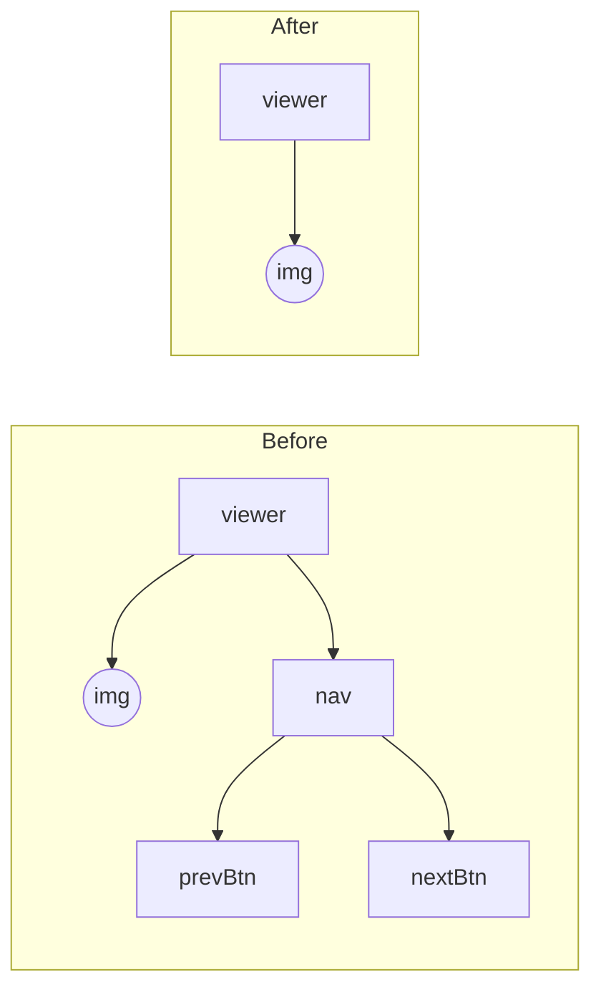
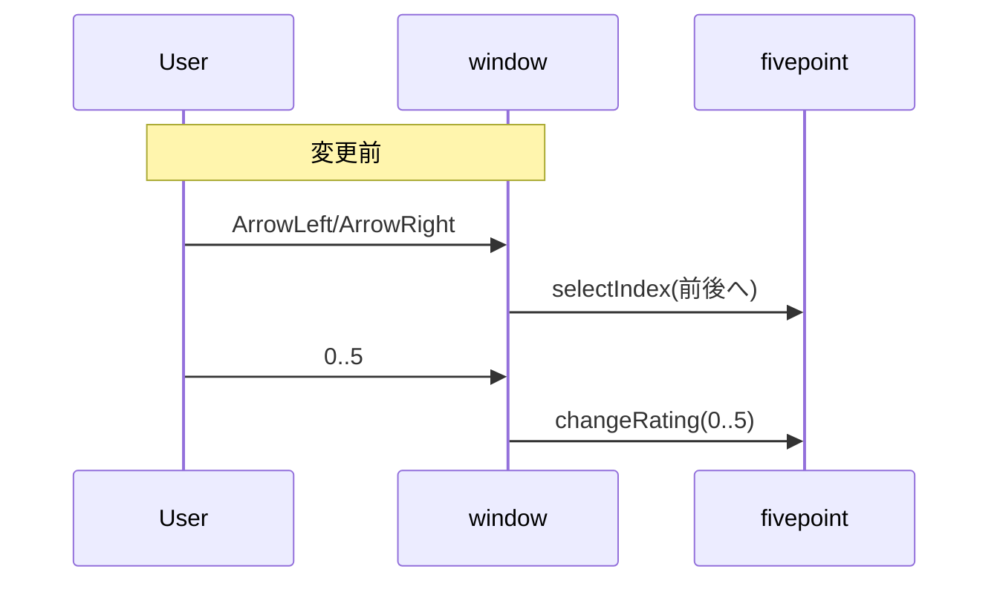
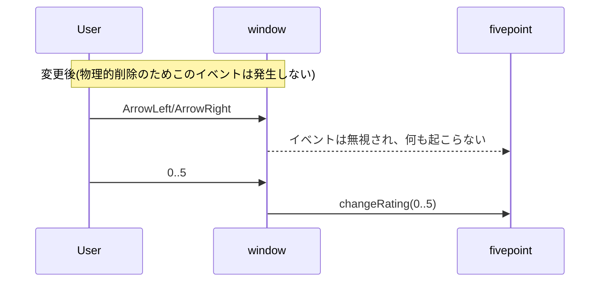

# 設計・実装仕様: 前へボタンと次へボタンの削除（/design - 00005）

## 目的/方針
- 画像ビューアの「前へ」「次へ」ナビゲーション機能を廃止する。
- UIの矢印ボタン（DOM）を削除し、左右キー（←/→）での前後移動を無効化する。
- 代替操作（サムネイルクリックでの切替）や評価変更（0–5）は従来通り維持する。
- 不要なイベントリスナを除去し、DOM 不存在（非表示ではなく削除）とする。

## 対象/非対象
- 対象:
  - UIボタン: `prevBtn` / `nextBtn`
  - キーボード: `ArrowLeft` / `ArrowRight` による移動
- 非対象（退行不可）:
  - フォルダ選択、再読み込み、通番初期化、全て初期化
  - サムネイルクリックでの画像切替
  - 評価変更（`0`〜`5`）
  - 実サイズ表示のトグル/ドラッグ（ズーム・パン）
  - D&D による画像追加、JPEG 変換

## 現状確認（参照元）
- ファイル: `src/fivepoint.html`
  - 矢印ボタンのDOM: `src/fivepoint.html:194`〜`src/fivepoint.html:197`
    - `
` の配下に `#prevBtn` / `#nextBtn`
  - 矢印のスタイル: `src/fivepoint.html:112`〜`src/fivepoint.html:117`（`.nav` / `.nav .arrow`）
  - サムネイルクリック切替: `src/fivepoint.html:513`（`item.addEventListener('click', () => selectIndex(i))`）
  - 評価ドロップダウン変更: `src/fivepoint.html:735`
  - 矢印クリックのリスナ: `src/fivepoint.html:736`〜`src/fivepoint.html:737`
  - キー操作（左右+数字）: `src/fivepoint.html:739`〜`src/fivepoint.html:745`

## 変更仕様（具体）
1) UI（DOM）の削除（数値化: 3ノード削除）
  - 削除: `
` コンテナ 1 要素、および子要素 `#prevBtn` / `#nextBtn` の 2 要素（計3要素）。
  - 対象箇所: `src/fivepoint.html:194`〜`src/fivepoint.html:197`

2) CSS の削除（数値化: 2ルール削除）
  - 削除: `.nav` と `.nav .arrow` の定義（それぞれ1ルール）。
  - 対象箇所: `src/fivepoint.html:112`〜`src/fivepoint.html:117`
  - 備考: 残置してもレイアウト崩れは発生しないが、不要定義のため削除方針。

3) JS: 矢印クリック用リスナの除去（数値化: 2行削除）
  - 削除: 
    - `document.getElementById('prevBtn').addEventListener('click', ...)`（`src/fivepoint.html:736`）
    - `document.getElementById('nextBtn').addEventListener('click', ...)`（`src/fivepoint.html:737`）
  - 目的: DOM を削除した後に `null.addEventListener(...)` でエラーとならないようにする。

4) JS: キー操作の見直し（数値化: 条件2件削除・1件維持）
  - 変更: `window.addEventListener('keydown', ...)` の内部から左右キーの分岐を削除し、`0`〜`5` のみを処理する。
  - 対象箇所: `src/fivepoint.html:739`〜`src/fivepoint.html:745`
  - 変更前（該当部分イメージ）:
    - `if (e.key === 'ArrowLeft') selectIndex(Math.max(0, currentIndex - 1));`
    - `if (e.key === 'ArrowRight') selectIndex(Math.min(files.length - 1, currentIndex + 1));`
    - `if (e.key >= '0' && e.key <= '5') changeRating(Number(e.key));`
  - 変更後（仕様）:
    - `if (progress.isActive()) return;`
    - `if (e.key >= '0' && e.key <= '5') changeRating(Number(e.key));`
  - コメントも更新（左右キー移動の説明を削除）。

5) 挙動の維持確認
  - サムネイルクリック切替（`src/fivepoint.html:513`）と、評価ドロップダウン変更（`src/fivepoint.html:735`）は変更なし。
  - 実サイズ表示のトグル/ドラッグ（`viewer` クラスのクリック/ドラッグ関連）も変更なし。

## 画面構成の差分（mermaid）

## キーイベントの差分（mermaid）

## 影響範囲とリスク
- 影響範囲: 上記4点（HTML/CSS/JS）に限定。`selectIndex`やファイル操作、D&D、評価処理は非影響。
- リスク: DOM削除後に参照（`getElementById('prevBtn'/'nextBtn')`）が残ると実行時エラーとなるため、必ずリスナ行を削除する。
- 回避策: 手順順守（DOM→CSS→JSの順は不問だが、最終的に両者を削除/修正）。

## テスト観点（退行なしの確認含む）
- UI/DOM:
  - 画面上に「前へ」「次へ」ボタンが存在しない（DOM 不存在）。
  - レイアウト崩れがない（クリック不能な透明領域が残存しない）。
- キー操作:
  - ←/→ を押しても画像が切り替わらない。
  - `0`〜`5` で評価が正しく変更される。
- 代替操作:
  - サムネイルクリックで該当画像に切替できる。
- 回帰:
  - フォルダ選択→読み込み→サムネイル表示→画像表示の一連に問題なし。
  - 実サイズ表示のクリック切替/ドラッグ移動が従来通り動作。
  - 画像のD&D追加が通番で行われる（末尾+1、JPEG 変換含む）。
  - コンソールエラーが出力されない。
- 端点:
  - 最初/最後の画像で ←/→ を押してもエラー・警告なし（無処理）。

## 実装手順（サマリ）
1. `src/fivepoint.html:194`〜`197` の `
` ブロックを削除。
2. `src/fivepoint.html:112`〜`117` の `.nav` / `.nav .arrow` のCSS定義を削除。
3. `src/fivepoint.html:736`〜`737` の `prevBtn`/`nextBtn` クリックリスナを削除。
4. `src/fivepoint.html:739`〜`745` の `keydown` ハンドラから `ArrowLeft/Right` 分岐を削除し、`0..5` のみを残す。コメント更新。
5. 動作確認（上記テスト観点）。

## 補足/非機能
- ドキュメントやヘルプに左右キー移動の記載がある場合は別タスクで更新（本要件の範囲外）。
