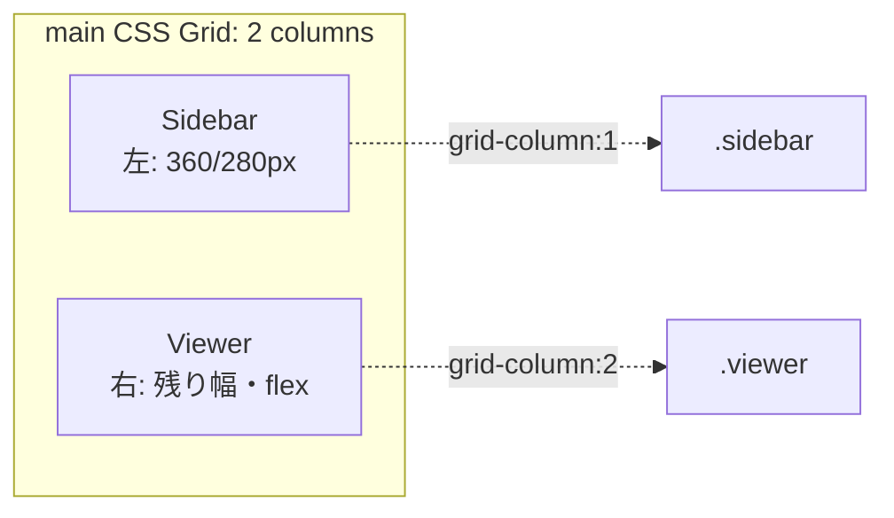

# 設計・実装仕様: ビューアとサイドバーの位置を逆にする (00007)

## 目的
- ビューアを右側、サイドバーを左側に配置する。
- 既存サイズ感は維持（サイドバー約 360px/280px、ビューアは残り）。
- JS の挙動・イベント・クラス/ID は変更しない（既存テストを全て維持）。

## 方針
- DOM 構造は変更せず、CSS Grid のカラム定義と子要素の配置指定で左右を入れ替える。
  - メリット: 影響範囲を CSS に限定し、JS への影響を最小化。
  - 注意: 視覚順と DOM 順が逆転するため、アクセシビリティ観点では DOM も入れ替えるのが理想。今回は範囲外だが、必要なら別タスクで対応可能。

## 変更対象
- `src/fivepoint.html` の `<style>` セクション（CSS のみ）。

## 具体的変更内容（CSS）
- `main` のグリッド定義を左右反転し、ブレークポイントも同様に反転する。
- 子要素の配置を明示し、`.sidebar` を 1 列目、`.viewer` を 2 列目に固定する。

変更案（抜粋・差分イメージ）:

```css
/* 反映前 */
main {
  display: grid;
  grid-template-columns: 1fr 360px; /* 右にサムネ */
}
@media (max-width: 1000px) {
  main { grid-template-columns: 1fr 280px; }
}

/* 反映後 */
main {
  display: grid;
  grid-template-columns: 360px 1fr; /* 左にサムネ */
}
@media (max-width: 1000px) {
  main { grid-template-columns: 280px 1fr; }
}

/* 子の配置を明示（DOM順は据え置き） */
.sidebar { grid-column: 1; }
.viewer  { grid-column: 2; }
```

- 既存の `.viewer`, `.sidebar` のスタイルや、ビューワの実寸・ドラッグ用クラス（`.viewer--actual`, `.viewer--dragging`）には変更を加えない。

## 代替案（参考）
- DOM を入れ替え、`grid-template-columns` だけを反転（`grid-column` 指定は不要）。
  - 長所: 視覚順と読み上げ順/タブ順が一致。
  - 短所: HTML 差分が発生。今回は影響最小化のため採用しない。

## 影響範囲と互換性
- JS: `getElementById('viewer')` 等の参照は不変のため影響なし。
- 既存テスト: タイトル、クラス付与挙動等に依存しており、レイアウト変更では不変。
- ドキュメント: UI 図面は別タスクで更新（本件の範囲外）。

## 受け入れ条件（確認項目）
- サイドバーが左、ビューアが右に表示される。
- ウィンドウ幅 1000px 以下でも同様に左サイドバー（約 280px）、右ビューアである。
- ビューアのクリックによる実寸トグル、ドラッグ移動がこれまで通り動作する。
- サムネイル選択・評価変更・各ボタン操作が退行なく動作する。
- スクロール挙動（サイドバー内のサムネ一覧、ビューアの縦スクロール）が従来通り。

## 実装手順（タスク）
1. `src/fivepoint.html` の CSS を上記のとおり変更。
2. 手動確認（受け入れ条件の全項目）。
3. 既存テストを実行し、全て成功することを確認。

## 補足（将来タスク候補）
- アクセシビリティ向上のため DOM 順も視覚順に合わせて入れ替える改善。
- UI ドキュメント（`context/doc/04-ui.svg` 等）の更新。

## Mermaid 図（レイアウト）

